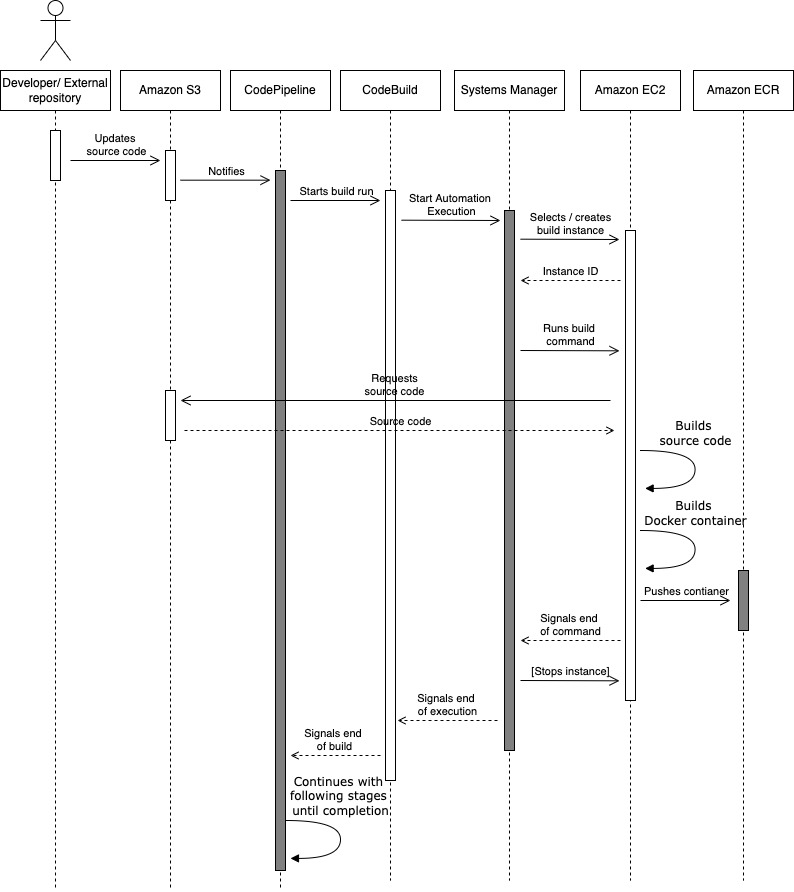
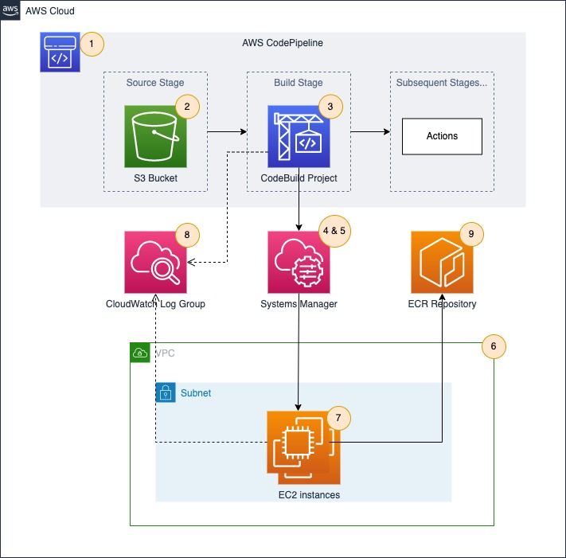

## Building Windows containers with AWS CodePipeline on AWS GovCloud (US) 

## Introduction

This project contains code used and explored in the AWS blog post [Building Windows containers with AWS CodePipeline on AWS GovCloud (US)](https://aws.amazon.com/blogs/modernizing-with-aws/building-windows-containers-with-aws-codepipeline-on-aws-govcloud-us/).

## Folder structure

```
./templates         <- Complete AWS Cloud Formation template to deploy the solution.
./src/sample-app    <- Sample ASP.NET MVC application's source code to test the solution.
```

## Solution overview

The following diagram shows the steps and actors involved during the execution of the solution:



Following is the description of the previous diagram:

1.	A new version of the source code is updated to Amazon Simple Storage Service (Amazon S3).
2.	CodePipeline reacts to this update and triggers a new pipeline execution.
3.	CodePipeline starts a new CodeBuild run.
4.	CodeBuild starts the execution of a Systems Manager Automation runbook orchestrating the build jobs and agents.
5.	Systems Manager selects a build agent from the existing ones, or creates one if none is available.
6.	Systems Manager runs the build commands in the selected build agent, this includes creating the container and pushing it to an Amazon Elastic Container Registry (Amazon ECR) repository.
7.	Systems Manager stops the build agent if set to do so.
8.	CodePipeline continues with the following stages defined until completion.

## Architecture

The following diagram shows the components involved in the solution:



1.	CodePipeline pipeline used to orchestrate the whole CI/CD pipeline.
2.	Amazon S3 bucket where the source code will be stored and changes will be posted.
3.	CodeBuild project in charge of starting the execution of the Systems Manager Automation used to manage build agents and run build jobs.
4.	Systems Manager Automation runbook in charge of orchestrating the build agents and starting the build job.
5.	Systems Manager Command document in charge of defining the actual commands to run as part of the build job.
6.	Amazon Virtual Private Cloud (Amazon VPC) in which to create the Amazon EC2 instance used for the build process.
7.	Group of one or more Amazon EC2 instances used as build agents.
8.	Amazon CloudWatch log group where the logs from the CodeBuild run and the build agent will be collected.
9.	Amazon ECR repository to store the built Windows container image.

## Deployment

Use [CloudFormation console](https://console.aws.amazon.com/cloudformation) or API to deploy the template. You can configure the following variables:

| Variable name | Default value | Description |
|---------------|---------|-------------|
| S3ObjectKey | windows-containers-govcloud-cicd.zip  | Key of the Amazon S3 object containing the source code to build. |
| EcrRepoName |  windows-containers-govcloud-cicd | Name of the target Amazon ECR repository. |
| BuildAgentPool | windows-containers-govcloud-cicd | Name of the agent pool to use. |
| StopAfterBuild | false | Determines if build agents are stopped after a build job has finished. |
| BuildAgentAmiId | {{ssm:/aws/service/ami-windows-latest/Windows_Server-2019-English-Core-ContainersLatest}} | AMI ID or SSM parameter expression used for new build agents. |
| BuildAgentInstanceType | t3.medium | Type of EC2 instance used for new build agents. For more information, see https://aws.amazon.com/ec2/instance-types. |
| BuildAgentVolumeSize | 50 | Size in GBs for the EBS volume attached to new build agents. |
| BuildAgentVolumeType | gp3 | Type of EBS volume attached to new build agents. For more information, see https://docs.aws.amazon.com/AWSEC2/latest/UserGuide/ebs-volume-types.html. |
| BuildAgentName | Value for the 'Name' tag assigned to new build agents. |
| BuildAgentKeyPairName |  | Name of the key pair used for new build agents. |
| BuildAgentVpcId |  | Subnet ID in which new build agents will run. |
| BuildAgentSubnetIds |  | Comma-separated list of Subnet IDs in which the Build Agent will be run. |
| BuildAgentSecurityGroupIds |  | List of Security Group IDs to attach to new build agents. |
| CloudWatchLogGroupName |  /aws-blog/windows-on-aws/windows-containers-govcloud-cicd | Name of the Amazon CloudWatch log group where to collect logs from CodeBuild and the build agents. |


Once the CloudFormation Template is deployed, you will need to upload some code to test the pipeline. I have included a sample .NET Framework app you can use for this purpose. To use it, foloow the next steps:

1. Download  and zip the contents of the [sample-app](./src/sample-app/) folder.
2. The value of the `S3ObjectKey` CLoudFormation parameter and the name of your .zip file mus match.
3. Upload the .zip file to the Amazon S3 Bucket created by the CloudFormation template (you can use the Console, CLI, an IDE extension or any other third party software to chieve this).

After you upload the file into your Amazon S3 bucket, you can navigate to the [CodePipeline console](https://console.aws.amazon.com/codesuite/codepipeline/pipeline) to see your pipeline running. If it is not running, try waiting a few seconds or try releasing a new change manually by clicking on the **Create pipeline** button on the top right.

## Security

See [CONTRIBUTING](CONTRIBUTING.md#security-issue-notifications) for more information.

## License

This library is licensed under the MIT-0 License. See the [LICENSE](./LICENSE) file.
